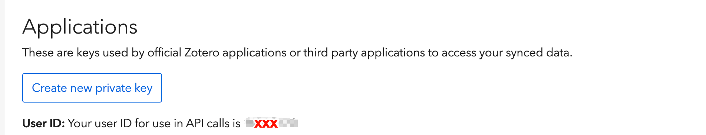

<div align="center">
  <h2>🧭 ZotPilot</h2>
  

  <p>
    <a href="https://www.zotero.org/">
      
    </a>
    <a href="https://claude.ai/code">
      
    </a>
    <a href="https://github.com/openai/codex">
      
    </a>
    <a href="https://modelcontextprotocol.io/">
      
    </a>
    <a href="https://pypi.org/project/zotpilot/">
      
    </a>
  </p>
  <p>
    
    
    
  </p>

  <p><b>让 AI agent 帮你搜论文、存论文、整理论文。数据不离开你的电脑。</b></p>

  <p>
    <a href="#快速开始">快速开始</a> &bull;
    <a href="#能做什么">功能</a> &bull;
    <a href="#工作原理">架构</a> &bull;
    <a href="#如何更新">更新</a> &bull;
    <a href="#常见问题">FAQ</a> &bull;
    <a href="README_EN.md">English</a>
  </p>
</div>

---

## 这是什么

ZotPilot 让 AI agent 成为你的文献研究助手。给它一个主题，它帮你搜论文、存到 Zotero、打标签、写笔记。

它有三个部分：

| 组件 | 作用 |
|------|------|
| **MCP Server** | 18 个工具：语义搜索、引用图谱、入库、标签/集合管理 |
| **Connector** | Chrome 扩展，让 agent 通过你的浏览器保存论文（带机构 PDF） |
| **Agent Skill** | 引导 agent 走完"搜索 → 入库 → 整理 → 报告"全流程 |

底层在你本地 Zotero 数据上建向量索引。搜到的结果知道在论文哪个章节、发在什么期刊，排序不只看相似度。论文数据始终在你电脑上，唯一的外部请求是嵌入 API（选 Local 模型连这个都没有）。

---

## 能做什么

ZotPilot 不只是一组工具——它通过 4 个 Agent Skill 引导 AI 走完完整的研究流程：

### 🔬 `ztp-research`：文献调研工作流

告诉 agent 你的研究主题，它自动走完四个阶段：

1. **Discovery** — 搜你本地库 + OpenAlex 外部检索，汇总候选论文，标出哪些已在库里
2. **Ingestion** — 通过 Connector 浏览器扩展批量入库，带机构 PDF
3. **Post-processing** — 用你已有的标签体系打标签、分到集合、建索引
4. **Final Report** — 逐篇汇总入库结果：PDF 状态、标签、集合归属

你只需要给主题、确认候选列表、处理偶尔的 anti-bot 验证。其余的 agent 按 Skill 里的决策树自动编排。

### 📖 `ztp-review`：文献综述与分析

对已有库内文献做深度分析：按主题聚类、提取关键发现、交叉引用比较、生成综述初稿。

### 📊 `ztp-profile`：库结构画像

分析你的文献库：主题分布、期刊结构、时间跨度、标签使用情况，帮 agent 理解你的研究方向。

### 🛠️ `ztp-setup`：安装与配置

引导 agent 完成 ZotPilot 的安装、配置、注册和排错。

---

### 底层能力

Skill 编排的背后是 18 个 MCP 工具：

| 能力 | 特色 |
|------|------|
| **语义搜索** | 按意思搜，不只匹配关键词。结果精确到章节段落（Results / Methods / Abstract），Q1 期刊排前面 |
| **一步入库** | DOI / arXiv / URL 混合输入 → Connector 浏览器保存（带机构 PDF）→ 自动验证 → 失败走 API fallback |
| **引用图谱** | OpenAlex 查引用链，在引用论文里搜特定观点（如批评某方法局限性的段落） |
| **批量整理** | 语义匹配 → 打标签、分集合、写笔记，同步回 Zotero。超过 5 篇先确认 |
| **学术检索** | OpenAlex 全参数 filter（引用数、机构、期刊、概念），找到直接入库 |

---

## 和其他方案的区别

| | 语义搜索 | 章节定位 | 入库 + 整理 | 引用图谱 | 安装 |
|------|:-:|:-:|:-:|:-:|--------|
| Zotero 原生 | ✗ | ✗ | ✗ | ✗ | — |
| 把 PDF 喂给 AI | ✓ | ✗ | ✗ | ✗ | 手动 |
| 自己搭 RAG | ✓ | 看实现 | ✗ | ✗ | 数小时 |
| [zotero-mcp](https://github.com/54yyyu/zotero-mcp) | ✓ | ✗ | 部分 | ✗ | ~5 min |
| **ZotPilot** | ✓ | ✓ | ✓（Connector） | ✓ | ~5 min |

ZotPilot 的差异：搜到的结果知道在 Results 还是 Methods 里，排序公式 `相似度^0.7 × 章节权重 × 期刊质量`；入库通过真实浏览器会话走 Zotero translator，能拿到机构 PDF；引用数据来自 OpenAlex（2.5 亿篇覆盖）。

---

## 快速开始

### 前置条件

- [Zotero](https://www.zotero.org/download/)（安装并运行过至少一次）
- Python 3.10+
- 支持 MCP 的 AI agent：Claude Code / Codex CLI / OpenCode

### 方式一：让 agent 帮你装

复制给你的 AI agent：

> 帮我安装 ZotPilot：clone https://github.com/xunhe730/ZotPilot.git 到 skills 目录，配置 Zotero 文献库。

它会 clone 仓库、装 CLI、配 Zotero、注册 MCP server。重启一次就能用。

**Skills 目录：**

| 平台 | 路径 |
|------|------|
| Claude Code | `~/.claude/skills/zotpilot` |
| Codex CLI | `~/.agents/skills/zotpilot` |
| OpenCode | `~/.config/opencode/skills/zotpilot` |

### 方式二：手动装

**1. Clone：**

```bash
# Claude Code
git clone https://github.com/xunhe730/ZotPilot.git ~/.claude/skills/zotpilot

# Codex CLI
git clone https://github.com/xunhe730/ZotPilot.git ~/.agents/skills/zotpilot

# OpenCode
git clone https://github.com/xunhe730/ZotPilot.git ~/.config/opencode/skills/zotpilot
```

**2. 配置嵌入模型（三选一）：**

| Provider | 质量 | 离线 | 获取 API Key |
|----------|------|:---:|-------------|
| Gemini [`gemini-embedding-001`](https://ai.google.dev/gemini-api/docs/embeddings) | MTEB 68.32 | ✗ | [Google AI Studio](https://aistudio.google.com/apikey)（免费） |
| DashScope [`text-embedding-v4`](https://help.aliyun.com/zh/model-studio/embedding) | MTEB 68.36 | ✗ | [阿里云百炼](https://bailian.console.aliyun.com/)（免费） |
| Local [`all-MiniLM-L6-v2`](https://huggingface.co/sentence-transformers/all-MiniLM-L6-v2) | MTEB ~56 | ✓ | 不需要 |

选了之后不好换（向量维度不同，换模型要 `zotpilot index --force` 全部重建）。

```bash
# 保存 API key（Local 用户跳过）
zotpilot config set gemini_api_key <your-key>    # Gemini
zotpilot config set dashscope_api_key <your-key>  # 或 DashScope
```

**3. 注册 MCP server：**

```bash
python3 scripts/run.py register    # 源码安装（clone 方式）
zotpilot register                  # pip/uv 安装
```

> Windows 用户：`python3` 换成 `python`

**4. 重启 AI agent。**

**5. 安装 Connector 浏览器扩展：**

Connector 是入库工作流的核心——agent 通过它用你的浏览器保存论文到 Zotero，带上机构订阅的 PDF。没有 Connector，有 DOI 的论文只能存元数据（无 PDF），纯 URL 入库直接失败。

<!-- TODO: screenshot — Chrome 扩展管理页加载 connector -->

1. 从 [GitHub Release](https://github.com/xunhe730/ZotPilot/releases) 下载 `zotpilot-connector-v0.5.0.zip`
2. 解压到任意目录
3. Chrome → `chrome://extensions` → 开启**开发者模式** → **加载已解压的扩展程序**
4. 确认状态栏出现 Zotero 图标

> ZotPilot Connector 是官方 Zotero Connector 的 fork，在原有保存能力上加了 agent 调用路径。两者可以共存——官方扩展处理手动保存，ZotPilot Connector 处理 agent 调用。

如果你只用搜索、引用、整理（不需要 agent 入库），可以暂不装。

**6.（可选）启用写操作：**

搜索和引用装好就能用。打标签、建集合需要 Zotero Web API 密钥：

1. 打开 [zotero.org/settings/keys](https://www.zotero.org/settings/keys)
2. 记下页面顶部的**数字 User ID**（不是用户名）
3. 创建 private key，勾 "Allow library access" + "Allow write access"



```bash
zotpilot config set zotero_user_id 12345678
zotpilot config set zotero_api_key YOUR_KEY
zotpilot doctor   # 验证：应显示 ✓
```

<details>
<summary>其他配 key 的方式</summary>

环境变量（`.zshrc` / `.bashrc` 中 export）：

```bash
export ZOTERO_USER_ID=12345678
export ZOTERO_API_KEY=YOUR_KEY
```

通过 `register` 写入 MCP 配置（不推荐，key 会留在配置明文中）：

```bash
zotpilot register --gemini-key <key> --zotero-api-key <key> --zotero-user-id <id>
```

</details>

---

## 实际用起来是什么样

<!-- TODO: screenshot 或 demo.gif — agent 中使用 ZotPilot 的对话 -->

| 你说 | agent 做 |
|------|---------|
| "搜我的论文，关于 X" | 语义搜索已索引论文 |
| "哪些论文的 Results 里提到 Y？" | 按章节 + 关键词定位段落 |
| "找比较模型准确率的表格" | 搜 PDF 提取的表格内容 |
| "谁引用了这篇？怎么评价？" | OpenAlex 查引用 + 搜观点 |
| "帮我找 Z 领域的最新论文" | OpenAlex 检索 → 入库 → 整理 |
| "给这些论文打标签，分到 X 集合" | 批量标签 + 集合管理 |
| "索引了多少论文？" | 索引状态检查 |

---

## 如何更新

### 从 v0.4 升级到 v0.5

v0.5 重构了工具层（33→18 个），升级后必须重新注册：

```bash
pip install --upgrade zotpilot     # 或 uv tool upgrade zotpilot
zotpilot register                  # 必须——工具签名变了
```

再装 Connector（见上方第 5 步）。索引不需要重建，v0.5 会自动清理过时条目。

> 如果之前用 `register --gemini-key` 传 API key，升级后改用 `zotpilot config set gemini_api_key <key>`（更安全）。

### v0.5+ 日常更新

```bash
zotpilot update                    # 自动探测安装方式，更新 CLI + skill
zotpilot update --check            # 只查版本
zotpilot update --dry-run          # 预览，不执行
```

更新后跑 `zotpilot status` 确认版本。客户端没反应就完全重启。

---

## 工作原理

```
索引（跑一次）
Zotero SQLite ──→ PDF 提取 ──→ 分块 + 章节分类 ──→ 向量嵌入 ──→ ChromaDB

查询（每次）
Agent ──→ MCP 工具 ───┬── 语义搜索 ──→ ChromaDB ──→ 重排序 ──→ 结果
                      ├── 引用图谱 ──→ OpenAlex
                      ├── 文献浏览 ──→ Zotero SQLite（只读）
                      ├── 写操作   ──→ Zotero Web API ──→ 同步回 Zotero
                      └── 入库     ──→ Bridge + Connector ──→ Zotero Desktop
```

- **索引**：从 Zotero SQLite（`mode=ro&immutable=1`，只读）读元数据，PyMuPDF 提取 PDF 全文 + 表格 + 图表，按学术章节分块（Abstract / Methods / Results / …），嵌入存入 ChromaDB。增量索引，跑过的不重复。
- **搜索**：查询向量化 → ChromaDB 余弦相似度 → 章节感知重排序 + 期刊质量加权（Q1 排前面）。
- **入库**：Agent → 本地 bridge (127.0.0.1:2619) → Chrome Connector → Zotero Desktop。复用浏览器登录态和机构 VPN。
- **写操作**：标签和集合通过 Zotero Web API（Pyzotero），自动同步回客户端。

<details>
<summary>MCP 工具列表（18 个）</summary>

| 类别 | 工具 |
|------|------|
| 搜索 | `search_papers`、`search_topic`、`search_boolean`、`advanced_search` |
| 阅读 | `get_passage_context`、`get_paper_details`、`get_notes`、`get_annotations`、`browse_library`、`profile_library` |
| 发现 | `search_academic_databases` |
| 入库 | `ingest_by_identifiers` |
| 整理 | `manage_tags`、`manage_collections`、`create_note` |
| 引用 | `get_citations` |
| 索引 | `index_library`、`get_index_stats` |

`search_papers` 支持 `section_type` 参数搜表格/图表。`ingest_by_identifiers` 接受 DOI / arXiv ID / URL 混合输入。详见 [SKILL.md](SKILL.md)。

</details>

<details>
<summary>文件结构</summary>

```
~/.claude/skills/zotpilot/          # 或 ~/.agents/skills/zotpilot/（Codex）
├── SKILL.md                        # MCP 工具参考 + 使用指南
├── scripts/run.py                  # 引导脚本：自动安装 CLI + 注册
├── references/                     # 参考文档（工具详解、排错、配置）
├── src/zotpilot/                   # MCP server 源码
└── connector/                      # Chrome 扩展（基于 Zotero Connector fork）
    └── build/manifestv3/           # 预构建扩展
```

</details>

<details>
<summary>数据存储位置</summary>

```
# macOS / Linux
~/.config/zotpilot/config.json      # 配置
~/.local/share/zotpilot/chroma/     # 向量索引

# Windows
%APPDATA%\zotpilot\config.json
%APPDATA%\zotpilot\chroma\
```

</details>

---

## 常见问题

<details>
<summary>会改我的 Zotero 数据库吗？</summary>

不会。SQLite 用 `mode=ro&immutable=1` 打开，物理上写不进去。标签和集合走 Zotero 官方 Web API，变更正常同步回客户端。

</details>

<details>
<summary>Zotero 开着能用吗？</summary>

能，只读模式不冲突。

</details>

<details>
<summary>支持哪些 agent？</summary>

**官方支持（Skill + MCP）：** Claude Code、Codex CLI、OpenCode。

**MCP-only：** 任何支持 MCP 协议的 agent（Cursor、Windsurf、Gemini CLI 等）都能用工具，但没有 Skill 引导。

</details>

<details>
<summary>嵌入模型花多少钱？</summary>

Gemini 免费额度约 1,000 请求/天，够索引几百篇。超出后 $0.15/百万 token。DashScope 新用户 100 万 token 免费。Local 模型完全免费离线运行。

</details>

<details>
<summary>索引多久？</summary>

每篇 2-5 秒，300 篇约 15 分钟。`--limit 10` 先试试。跑过的自动跳过。

</details>

<details>
<summary>扫描版 PDF / 超长文献？</summary>

- 扫描版自动 OCR（需装 Tesseract：macOS `brew install tesseract tesseract-lang`，Ubuntu `sudo apt install tesseract-ocr`）
- 超过 40 页默认跳过（`--max-pages` 可调），`--item-key` 可单独索引
- 可选：Claude Haiku 修复复杂表格（需 `ANTHROPIC_API_KEY`）

</details>

<details>
<summary>能完全离线用吗？</summary>

能。嵌入选 `--provider local`，不配写操作 key，全部本地跑。搜索、浏览、索引都不需要网络。

</details>

<details>
<summary>引用数据从哪来？</summary>

[OpenAlex](https://openalex.org/)，覆盖约 2.5 亿篇文献，通过 DOI 查。没 DOI 的查不了引用，但语义搜索和标签管理不受影响。

</details>

---

## 出了问题

| 症状 | 怎么办 |
|------|------|
| 找不到 Skill | 确认 clone 到了正确的 skills 目录 |
| `zotpilot: command not found` | `python3 scripts/run.py status`（会自动装） |
| MCP 工具没出来 | `zotpilot register` 然后重启 agent |
| 搜出来是空的 | 先跑 `zotpilot index` |
| `GEMINI_API_KEY not set` | `zotpilot config set gemini_api_key <key>`，或换 `--provider local` |
| 不知道哪出了问题 | `zotpilot doctor` |

更多见 [references/troubleshooting.md](references/troubleshooting.md)。

---

<details>
<summary>开发 / 贡献</summary>

```bash
git clone https://github.com/xunhe730/ZotPilot.git
cd ZotPilot

# MCP server
uv sync --extra dev
uv run pytest
uv run ruff check src/

# Connector
cd connector
npm install
./build.sh -d
```

</details>

---

<div align="center">
  <p>
    <a href="https://github.com/xunhe730/ZotPilot/issues">报告问题</a> &middot;
    <a href="https://github.com/xunhe730/ZotPilot/issues">功能建议</a> &middot;
    <a href="https://github.com/xunhe730/ZotPilot/discussions">讨论</a>
  </p>
  <sub>MIT License &copy; 2026 xunhe</sub>
</div>
